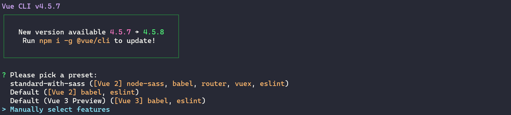
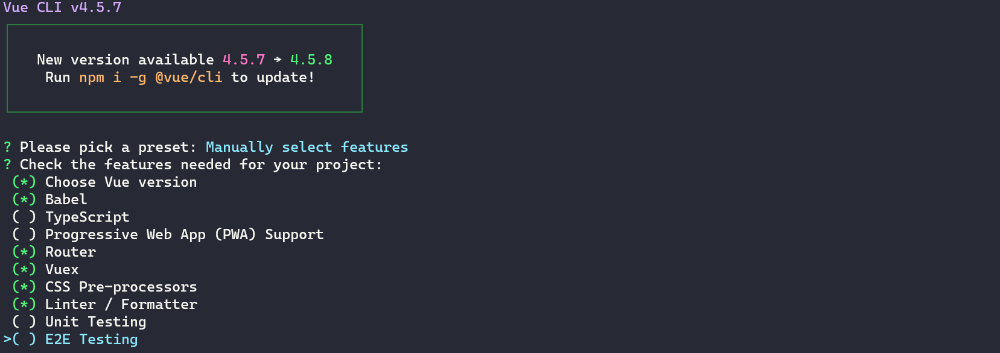
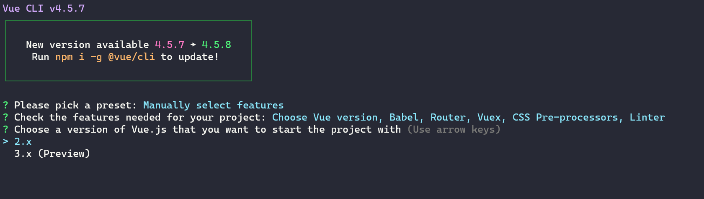
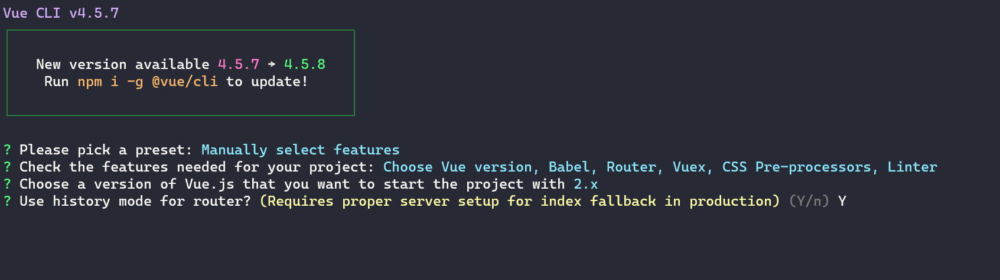
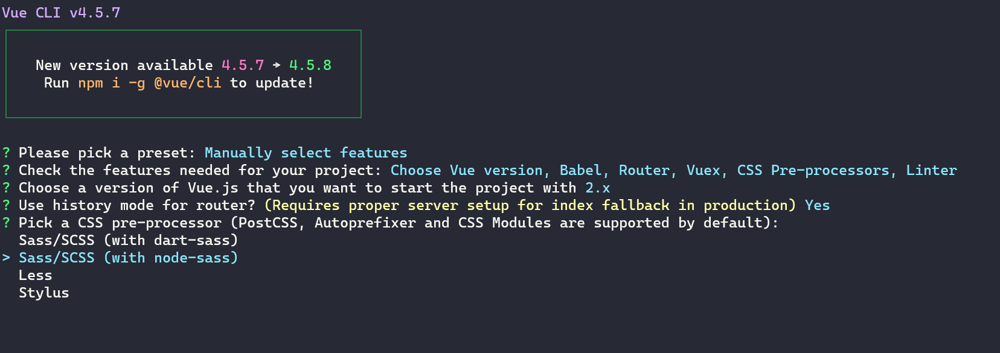
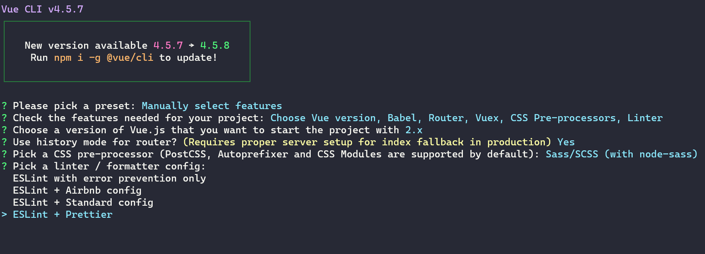

# Project template

This is a project template using Django and Vue.js with Sass. Below are described the steps I did in order to create this template.

### Step 1: - Create new django project

- 1.1 - Create a new directory: `mkdir project`
- 1.2 - CD to that directory: `cd project`
- 1.3 - Create a new virtual environment using pipenv: `pipenv install`
- 1.4 - Install django and django rest framework:
  - `pipenv install django`
  - `pipenv install djangorestframework`
- 1.5 - Start django project: `pipenv run django-admin startproject website`
- 1.6 - Rename the top `website` folder to `src`
- 1.7 - Install the django rest framework app

```python
INSTALLED_APPS = [
    "django.contrib.admin",
    "django.contrib.auth",
    "django.contrib.contenttypes",
    "django.contrib.sessions",
    "django.contrib.messages",
    "django.contrib.staticfiles",
    "rest_framework",
]
```

### Step 2: - Create first app

- 2.1 - CD to `src` directory: `cd src`
- 2.2 - Create a directory called: `apps`
- 2.3 - Create a `__init__.py` file in `apps` folder `touch __init__.py`
- 2.4 - Change directory to `apps`
- 2.5 - Create a django app: `pipenv run python ../manage.py startapp blog`
- 2.6 - Update the app config:

From

```python
class BlogConfig(AppConfig):
    name = 'blog'
```

To

```python
class BlogConfig(AppConfig):
    name = 'apps.blog'
```

- 2.7 - Add app to installed apps

```python
INSTALLED_APPS = [
    "django.contrib.admin",
    "django.contrib.auth",
    "django.contrib.contenttypes",
    "django.contrib.sessions",
    "django.contrib.messages",
    "django.contrib.staticfiles",
    "rest_framework",
    "apps.blog.apps.BlogConfig",
]
```

### Step 3 - Create the vue.js app

- 3.1 - Change directory to `src`: `cd src`
- 3.2 - Create the vue.js app using Vue CLI: `vue create frontend -n`
- 3.3 - Manually select features
  
- 3.4
  
- 3.5
  
- 3.6
  
- 3.7
  
- 3.8
  
- 3.9

### Step 4 - Create sass folder

- 4.1 - Change directory to `frontend/src`
- 4.2 - Create folder `sass`
- 4.3 - Create the following files: `_base.scss, _layouts.scss, _mixins.scss, _variables.scss`

### Step 5 - Create vue config file and add loader options

- 5.1 - Create file `vue.config.js`
- 5.2 - Add the following options for sass loader

```js
module.exports = {
  css: {
    loaderOptions: {
      sass: {
        prependData: `
            @import "@/scss/_variables.scss";
            @import "@/scss/_mixins.scss";
          `,
      },
    },
  },
};
```
